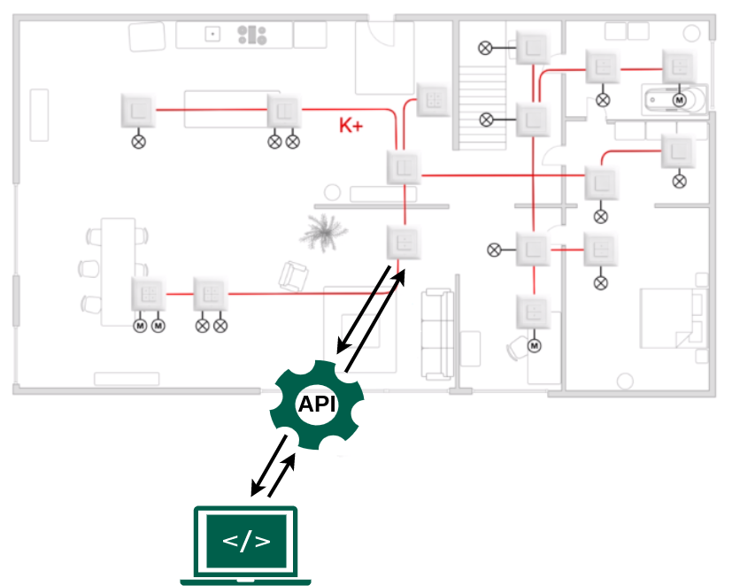

# Wiser-by-Feller RESTFul API Overview

> 🐮 Hi, my name is **Lapi**, I'm a happy swiss-cow! I am glad that you find the long way here! I will take you on my back and guide you through this weird documentation.

The Wiser-by-Feller RESTFul API enables you to manage all your system devices.

Per example, is possible to turn on or off the lights in your house over the RESTFul API. You can get the state of the lights and do other crazy IoThings.

> 🐮 Wow sounds great, I would like to turn off the bell on my neck!

More information can be found on https://wiser.feller.ch

## Control your Wiser-by-Feller system over the RESTFul API



> 🐮 Looks like my cowshed!

## FAQ

- What do you mean? Read [here](./doc/faq.md)

## Get started

### HTTP Guidelines

- [JSend](https://github.com/omniti-labs/jsend) - Simple JSON responses
- A successful request is indicated by HTTP status code: `200 OK`
- Supported HTTP versions are: `HTTP/1.0, HTTP/1.1`
- HTTP methods (Verbs): `GET, PUT, DELETE, POST, PATCH`

> 🐮 `GET` fresh grass, `PUT` out smelly cowpie! This is a real status code: `200 OK`!

### Authentication

Every request to the Wiser-uGateway must include an authentication token.

Read [here](./doc/authentication.md) how you get an authentication token.

> 🐮 The burn mark (a QR-code) on my back!

### Access to data

- If you want to turn **on** or **off** some lights, read more about [loads](./doc/api_loads.md)
- [TODO or !TODO]

> 🐮 Please no more loads, your heavy enough!

## Tools

- Examples using [cURL](./doc/tool_curl.md)

> 🐮 The dairy machine, GPS-Receiver, ...

## The End

``` bash
 _________
< Finally >
 ---------
        \   ^__^
         \  (**)\_______
            (__)\       )\/\
             U  ||----w |
                ||     ||
```

Made with ❤️ (and some couples of 🍺) in Switzerland, Feller AG, 2021
