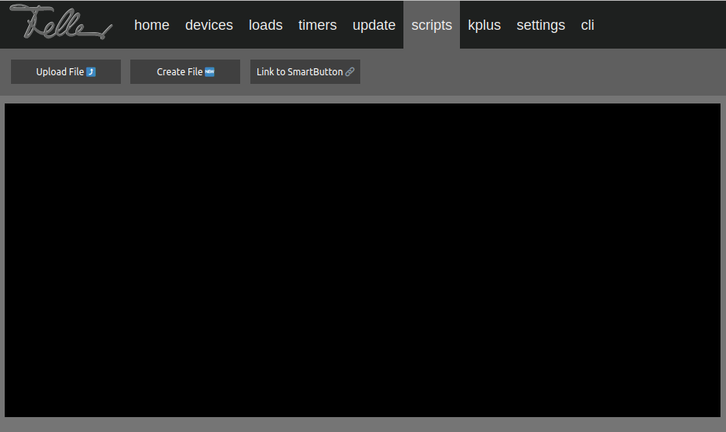
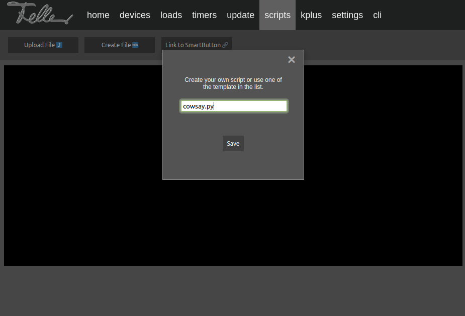
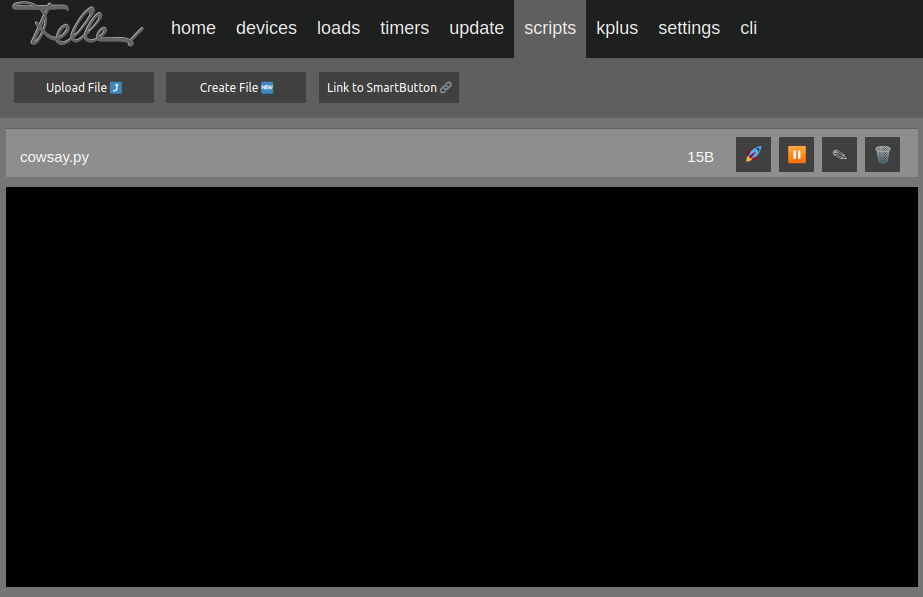
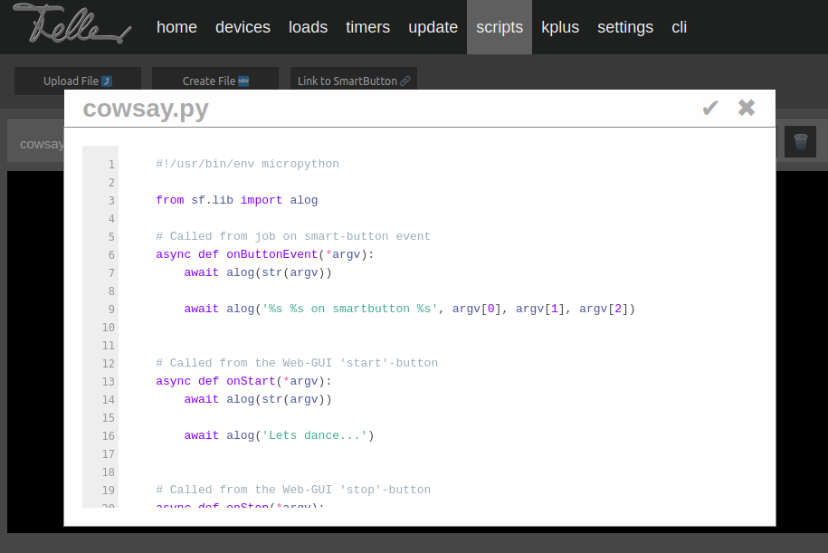
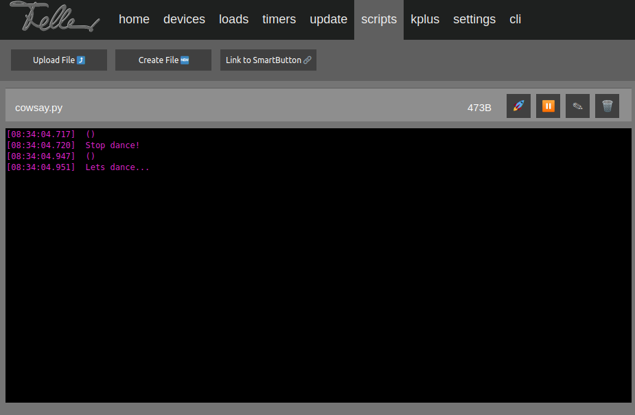
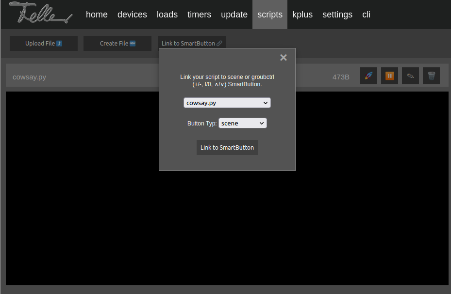
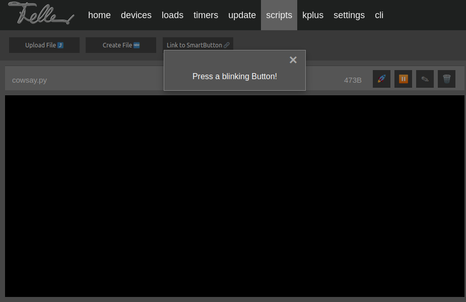
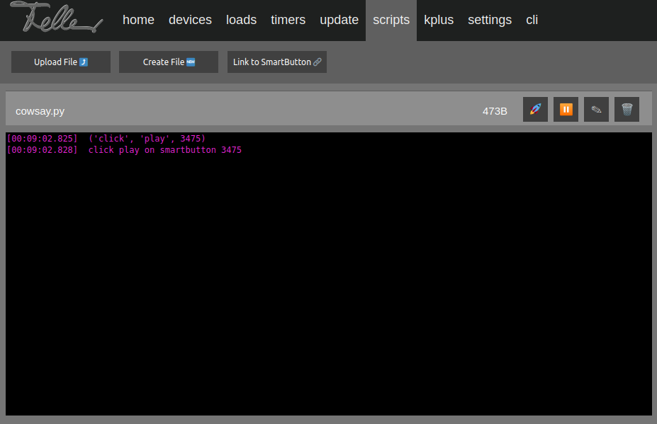
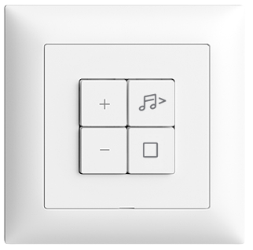

# Scripting

## Overview

The Wiser-by-Feller µGateway provides a script-engine to extend the Wiser-by-Feller functionality of [smartbuttons](./api_smartbuttons.md) with 3rd party services.

Some infos about the script-engine:

- Minimum required Wiser-by-Feller µGateway SW-Version `>= 5.1.25`
- Script-langauge is (Micro-)Python
- **The script-engine is still in Beta/Experimental state!**

Using scripting allows you to invoke an action on 3rd party devices e.g. smart-lights that provides a REST-API by pressing a Wiser-by-Feller [smartbutton](./api_smartbuttons.md).

The execution of a script is configured in a [job](./api_jobs.md) and a [job](./api_jobs.md) can be marriage with a [smartbutton](./api_smartbuttons.md).
That means, by pressing a [smartbutton](./api_smartbuttons.md) your script will be executed.

Uses-Cases:

- Turn on or off a smart-light via REST-API.
  - Button-type: `scene`
  - Example: `hue_scene.py`

- Increase or decrease the volume of your music-box via REST-API.
  - Button-type `groupctrl`
  - Example: `sonos.py`

On the Wiser-by-Feller µGateway there is a simple Web-GUI used for Customer-Support.
Use a browser and enter the IP-address or hostname of your µGateway e.g. "http://192.168.1.123".
On first-time use, you need to create an account.

## Create a script and link it with a scene-smartbutton

There is an easy way to create a script and link it with a [smartbutton](./api_smartbuttons.md), without breaking your head by using the µGateway Web-GUI.
Of course, you can do all the steps using the µGateway REST-API.

1) Login to the Web-GUI of your Wiser-by-Feller µGateway e.g. "http://192.168.1.123" and click on tab scripts.

    Here you can upload your script or you can create a new one.

    

2) Lets create a new script by pressing button **[`Create File 🆕`]** and named it `cowsay.py`.

    **Note:** Have a look at the script examples/templates in the dropdown-list:
    - hue_scene.py
    - hue_ctrl.py
    - sonos.py

    

3) The new script file is created.

    **File-Actions:**

    Action | Description
    --- | ---
     | Run/start the script. This will invoke first the function `onStop` and then `onStart`
     | Stop the script. This will invoke the function `onStop`
     | Edit the script
     | Delete the script

    

4) Lets write some code. Press the pencil-button **[✎]** and copy the code inside.

    ```python
    #!/usr/bin/env micropython

    from sf.lib import alog

    # Called from job on smart-button event
    async def onButtonEvent(*argv):
        await alog(str(argv))

        await alog('%s %s on smartbutton %s', argv[0], argv[1], argv[2])


    # Called from the Web-GUI 'start'-button
    async def onStart(*argv):
        await alog(str(argv))

        await alog('Lets dance...')


    # Called from the Web-GUI 'stop'-button
    async def onStop(*argv):
        await alog(str(argv))

        await alog('Stop dance!')

    ```

    

5) Press the start-button **[🚀]**

    

6) To link the script-file with a [smartbutton](./api_smartbuttons.md), press the button **[Link to SmartButton🔗]**.

    Now a popup-window will appears. Choose your file `cowsay.py` and button-type `scene`.

    Afterwards press button **[Link to SmartButton]**.

    

7) At this moment all available [smartbuttons](./api_smartbuttons.md) from type `scene` will start blinking (color: `purple`) and wait until one is pressed.

    

8) After pressed [smartbutton](./api_smartbuttons.md) from type `scene` the script is linked and ready for use.

    

9) Now click the [smartbutton](./api_smartbuttons.md) (that you linked before) and your script will be executed.

    

## Wiser-by-Feller button decoration

Lets decorate your Wiser-by-Feller buttons with different icons such as: `play`, `stop`, ...

- [STANDARDdue push button 1/4](https://online-katalog.feller.ch/kat_details.php?fnr=915-3400.4.QMI.61)
- [EDIZIOdue push button size 1/4](https://online-katalog.feller.ch/kat_details.php?fnr=915-3400.4.FMI.61)

Example (EDIZIOdue push button size 1/4):



> 🐮  Click button below for clean up this mess


