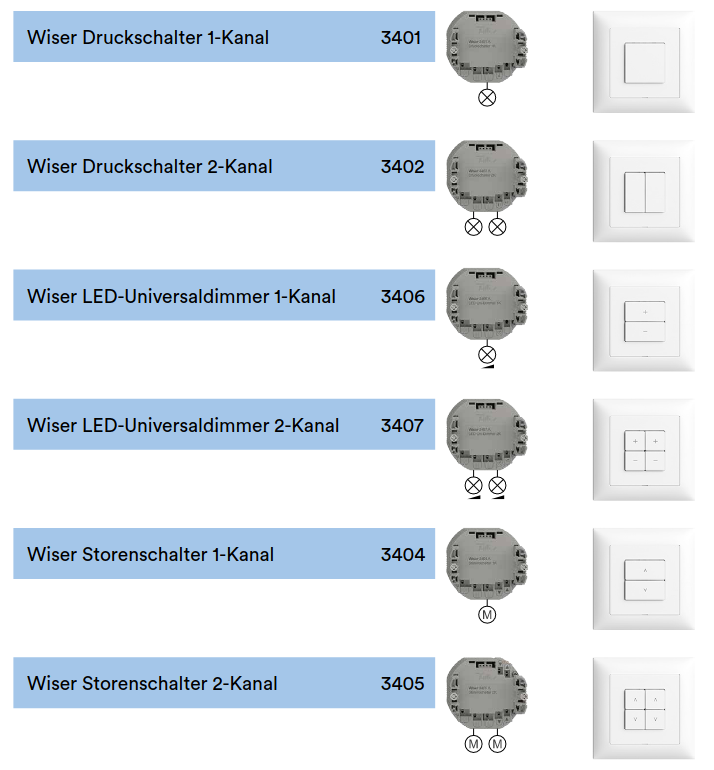

# Frequently asked questions about devices

## Which `devices` exists?

Here a device overview and how they looks:

## How to wiring a `device`?

### OnOff 1K

### OnOff 2K

### Dimmer 1K

### Dimmer 2K

### Motor 1K

### Motor 2K

